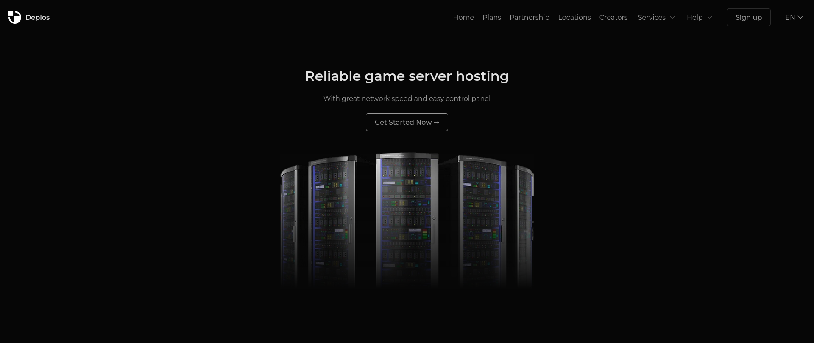

<h1><a href="https://deplos.github.io">Deplos</a></h1>

Landing page of Deplos hosting provider, which is currently aboundoned

 
 

## Requirements
> 1. **Contentful** - used as database to get the data of guides (see `/src/js/guide/guideController.js`)
> 2. **Formidable** - used in Contact forms (see `/src/js/form.js`)

## How to use 
1. `npm install`
2. `npm run start`

## License 
Project is licensed under the GPLv3 (see `LICENSE`)